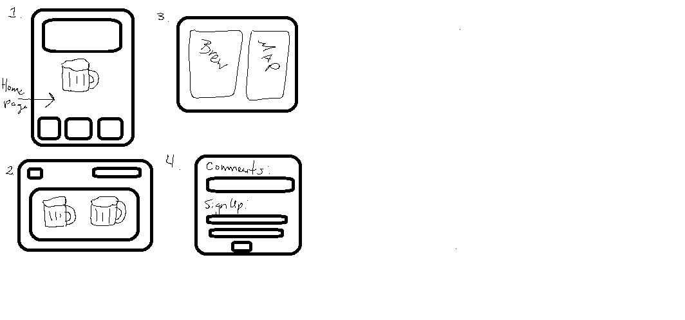

# breweryConnoisseur
Team members:

Noman, Mel, Kevin and Ahmad 

Project Name: 

DMV Brew Connoisseur 

A DMV beer resource for coders

Possible taglines: Debug and Brew, Coding is thirsty work 

Guthub Repo:
https://github.com/capersnr/breweryConnoisseur

Core Project Feature 

Search for businesses via Yelp API that are listed as a brewery within 10 miles of DMV

Display results and map location using Google MAPs API 

Allow filtering by Yelp rating, outdoor seating, etc 

Team Assignments

Mel – lead design/html/css/bootstrap

Norman – Github master branch management/merging branches 

Kevin APIs for Yelp 

Ahmad Google Maps API 

Additional features time permitting 

Local event listing page using Firebase

Learn about beer section 

	API from BreweryDB or RateBeer 

Design Notes:
Landing page: large background image, minimize scrolling  

Sample wireframes 

